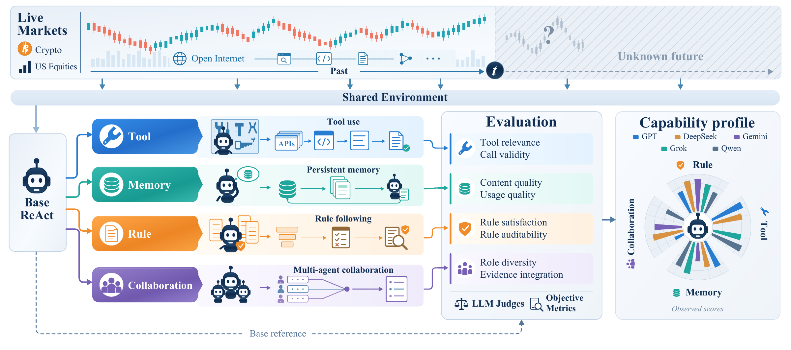

<div align="center">

# LiveMACEBench

### Process-Aware Evaluation of LLM Agent Capabilities in Evolving Markets

Live markets. Persistent agents. Trace-level evaluation.

[](https://arxiv.org/abs/2610.09872)
[](backend/pyproject.toml)
[](LICENSE)

**[Paper](https://arxiv.org/abs/2610.09872) · [Quick Start](#quick-start) · [Documentation](docs/README.md) · [Extension SDK](docs/extensions/README.md) · [Citation](#citation)**

</div>

<p align="center">
  <a href="docs/assets/livemace-framework.png">
    
  </a>
</p>

**LiveMACEBench** uses live financial markets as an evolving environment for evaluating persistent LLM agents. Agents gather information, reason, and execute simulated trades while the benchmark records their decisions, tool calls, memory interactions, and portfolio state.

The accompanying paper, [**LiveMACE: Process-Aware Evaluation of LLM Agent Capabilities in Evolving Markets**](https://arxiv.org/abs/2610.09872), studies five frontier LLMs across 30 days of live evaluation. It finds an **outcome–capability gap**: realized returns can diverge from capability measurements, and similar outcomes can emerge from different patterns of mechanism use.

## What LiveMACEBench evaluates

| Capability | What to investigate |
| :--- | :--- |
| **Tool Use** | Tool selection, call validity, information quality, and how results inform decisions. |
| **Persistent Memory** | How agents store, retrieve, and reuse experience over a continuing trajectory. |
| **Rule Following** | Adherence to explicit constraints and the auditability of trading decisions. |
| **Multi-Agent Collaboration** | Coordination, role specialization, and integration of evidence across agents. |

These capabilities are studied alongside portfolio outcomes and decision traces, connecting **what an agent achieves** with **how it acts**.

## Inside the platform

- **Live market environments** — cryptocurrency and US-equity data, with simulated orders, fees, leverage, positions, and portfolio accounting.
- **Configurable agents** — ReAct, MultiAgent, AdvancedMultiAgent, and RuleAware implementations, plus buy-and-hold and grid baselines.
- **Trace-level inspection** — account-scoped decisions, tool calls, memory, compliance, and evaluation checkpoints.
- **Interactive dashboard** — compare performance curves and inspect the decisions behind portfolio changes.
- **Extensible runtime** — add Agents, Tools, and Prompt profiles through a shared SDK and per-account configuration.

Explore the [system architecture](docs/architecture.md), [evaluation metrics](docs/evaluation/metrics.md), or the full [documentation index](docs/README.md).

## Quick start

### 1. Install

You will need **Python 3.10+**, **uv**, **Node.js 18+**, and **pnpm**. Runtime services also use **Redis/Valkey** for the tool cache and **Docker** for agent sandboxes. Use MySQL for concurrent trading runs; SQLite is available for local development.

```bash
git clone https://github.com/RaymondVoldemortFu/LiveMACE.git
cd LiveMACE
pnpm run install:all
cp backend/.env.example backend/.env
```

### 2. Configure

Edit `backend/.env` for your environment:

| Setting | Purpose |
| :--- | :--- |
| `API_KEY`, `BASE_URL` | Model provider credentials and OpenAI-compatible endpoint. |
| `DATABASE_URL` | MySQL connection or local SQLite database. |
| `TOOL_CACHE_REDIS_URL` | Redis/Valkey connection for the shared tool cache. |
| `AI_TRADE_FIRST_EXECUTION_TIME`, `AI_TRADE_INTERVAL_SECONDS` | First decision time and recurring decision interval. |
| `ALPACA_KEY`, `ALPACA_SECRET` | US-equity market data credentials, when used. |

Memory and search integrations have additional settings in the [environment example](backend/.env.example). Start the configured database, Redis/Valkey, and Docker services before launching the application.

### 3. Run

```bash
pnpm run dev
```

| Service | Local address |
| :--- | :--- |
| Dashboard | [localhost:5621](http://localhost:5621) |
| API documentation | [localhost:5611/docs](http://localhost:5611/docs) |
| WebSocket | `ws://localhost:5611/ws` |

The frontend proxies `/api` and `/ws` to the backend. Scheduled trading and market-data tasks follow your account and environment configuration.

<details>
<summary><strong>Docker deployment</strong></summary>

Prepare `backend/.env` from the [example](backend/.env.example), then run from the repository root:

```bash
docker compose up -d --build
```

Open the dashboard at [localhost](http://localhost). Compose starts **Nginx**, **FastAPI**, **MySQL**, and **Redis/Valkey**. It supplies the internal database and cache addresses and mounts the Docker socket for agent sandboxes.

```bash
docker compose logs -f frontend backend
docker compose down
```

For Linux, a deployment helper is also available:

```bash
./scripts/linux_dev_one_click_deploy.sh
```

For an existing deployment, follow the [environment update guide](docs/development.md#更新已有环境) to retain its database and volume configuration.

</details>

<details>
<summary><strong>Batch account setup</strong></summary>

From `backend/`, create model accounts for the configuration combinations in your CSV:

```bash
uv run python script/create_accounts_from_env.py --mode all-combinations
```

Set `ACCOUNT_COMBO_CSV_PATH` in `backend/.env` to your CSV. Each row defines one configuration; the script creates an account for each model and configuration pair. See the [example CSV](backend/config/account_combinations.example.csv).

Required columns:

```text
account_type,agent_type,memory_enabled,tool_routing_enabled,enable_rule_aware,is_active
```

The script initializes missing database tables. Add `--update-existing` to update accounts with matching names:

```bash
uv run python script/create_accounts_from_env.py --mode all-combinations --update-existing
```

</details>

<details>
<summary><strong>Frontend build</strong></summary>

```bash
pnpm run build:frontend
```

Vite writes the frontend assets to `frontend/dist/`. The FastAPI backend runs with Uvicorn or another ASGI server. See the [development guide](docs/development.md) for contributor workflows.

</details>

## Build your own extensions

Agents, Tools, and Prompt profiles share a synchronous extension interface. Start with a [minimal Agent](examples/extensions/minimal-agent), a [read-only Tool](examples/extensions/read-only-tool), or a [Prompt override](examples/extensions/prompt-override).

From `backend/`:

```bash
uv run livemace-bench extension validate ../examples/extensions/minimal-agent
uv run livemace-bench extension test ../examples/extensions/minimal-agent
uv run livemace-bench extension list ../examples/extensions/prompt-override --json
```

The CLI is also available as `python -m benchmark` or `python -m benchmark.cli`.

**[SDK overview](docs/extensions/README.md) · [10-minute Agent guide](docs/extensions/10-minute-agent.md) · [Public interface reference](docs/extensions/interface-reference.md)**

## Citation

If you use LiveMACEBench in your research, please cite:

```bibtex
@article{zhao2026livemace,
  title   = {{LiveMACE}: Process-Aware Evaluation of {LLM} Agent Capabilities in Evolving Markets},
  author  = {Zhao, Jun and Fu, Leiming and Wen, Yanbo and Wang, Yiding
             and Liu, Xuantong and Shu, Yang and Lu, Yuyang and Xing, Xuanran
             and Tong, Jingqi and Xu, Hao and Zhang, Qi and Huang, Xuanjing},
  journal = {arXiv preprint arXiv:2610.09872},
  year    = {2026},
  url     = {https://arxiv.org/abs/2610.09872}
}
```

## Acknowledgments & license

LiveMACEBench's early architecture was built on [etrobot/open-alpha-arena](https://github.com/etrobot/open-alpha-arena). The codebase has since undergone substantial architectural refactoring to support process-aware evaluation of LLM agents. We thank the original project and its contributors for this foundation.

LiveMACEBench is released under the [MIT License](LICENSE).
