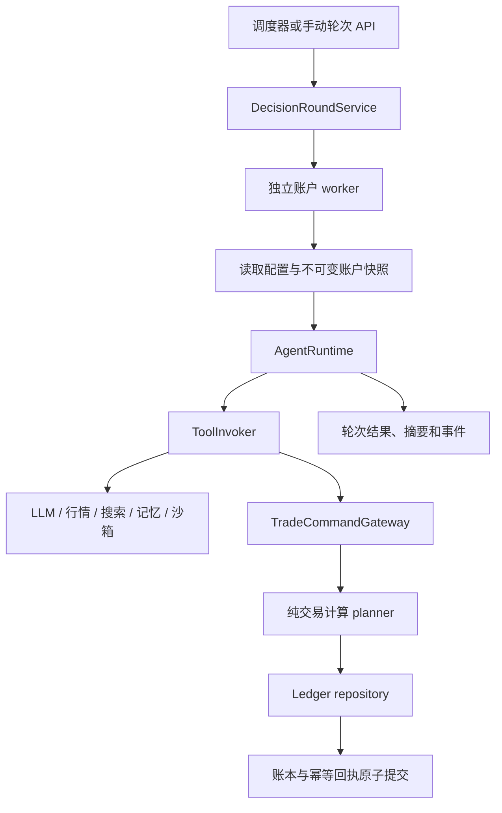

# LiveMACEBench 系统架构

LiveMACEBench 使用实时行情驱动 LLM Agent，并在模拟账本中记录交易。后端拥有账户、资金、持仓、订单、成交与评估结果；前端负责配置、展示和订阅。

## 主要边界

| 层 | 目录 | 职责 |
| --- | --- | --- |
| 控制台 | `frontend/app/` | 账户配置、收益曲线、决策轨迹、记忆与合规展示 |
| HTTP / WebSocket | `backend/api/`、`backend/schemas/` | 请求校验、响应 DTO、账户快照与事件读取 |
| 应用服务 | `backend/benchmark/application/` | 决策轮次、交易命令、周期结算和合规编排 |
| Agent / Tool / Prompt | `backend/benchmark/{agents,tools,prompts,builtin}/` | 同步扩展接口、组件注册、工具调用和内置实现 |
| 扩展与账户配置 | `backend/benchmark/{extensions,accounts}/` | Manifest、Catalog、版本、能力授权及账户选择 |
| 持久化 | `backend/benchmark/persistence/` | Repository、Unit of Work、账户锁、幂等回执及账本写入 |
| 基础设施 | `backend/benchmark/infrastructure/`、`backend/services/` | 行情、模型、缓存、沙箱与其他 provider 适配 |
| 启动生命周期 | `backend/benchmark/bootstrap/` | 装配、数据库初始化、后台服务启动和有序关闭 |

公共扩展接口由 [v1 规范](extensions/interface-reference.md) 定义，示例见 [扩展 SDK](extensions/README.md)。

## 决策与交易

`DecisionRoundService` 使用线程池按账户运行。每个 worker 独立读取并关闭 UoW，外部模型和工具调用使用已物化的输入。ReAct、MultiAgent、AdvancedMultiAgent 和 RuleAware 通过同一 Catalog 选择；buy-and-hold 与 grid baseline 使用独立调度路径。

账户配置包含 Agent、Prompt profile、组件版本、具名 `toolset_ids`、禁用工具及 Agent 参数。多个工具集合取并集，再应用禁用项和运行时能力约束。空集合选择沿用默认工具集合。

交易工具同步等待 Gateway 结果。Gateway 锁定账户，使用持久化幂等键处理重复调用，协调纯计算计划和 repository 写入，并将账本与 receipt 放在同一事务提交。业务拒绝不会部分修改资金和持仓；重复命令读取首次结果。轮次摘要负责记录观察结果。

## 数据与事务

- MySQL 用于并发运行，SQLite 可用于本地开发和单元测试。
- UoW 拥有 Session、提交、回滚和关闭；同一 UoW 不跨线程复用。
- 财务计算位于 `application/trading/planner.py`，输入是 detached 数据、报价和时间；`persistence/ledger.py` 应用计划。
- 周期结算由 `CheckpointService` 编排，`CheckpointBatch` 持有事务能力，并用 savepoint 隔离单个计算失败。
- 公共扩展只接收 DTO 和 provider ports，不获得 ORM 或 Session。

## 启动与关闭

`backend/main.py` 调用 `create_app()` 装配 ASGI 应用。数据库迁移、种子账户、凭据迁移和后台服务由应用 lifespan 管理。

| 模式 | 用途 |
| --- | --- |
| `FULL` | 完整服务及后台调度 |
| `NO_BACKGROUND` | HTTP / WebSocket 服务，后台任务不启动 |
| `SCHEMA_ONLY` | 脚本通过 bootstrap helper 初始化 schema |

后台任务通过注册表声明依赖。关闭先停止接纳新任务，再排空在途工作并释放资源。`/api/health` 展示生命周期状态，`/api/ready` 检查就绪状态和配置模式要求的依赖。

## 前端与契约

前端领域客户端位于 `frontend/app/lib/api/`；`generated-types.ts` 从后端 OpenAPI 生成。WebSocket 连接、心跳、重连和消息解码集中于 `frontend/app/lib/ws/`，快照合并由 `usePortfolioSnapshot` 负责。

开发时 Vite 把 `/api` 和 `/ws` 代理至后端；部署时由 Nginx 代理。前端只通过这些接口发出命令和读取后端事实。

## 事件与评估

运行事件关联账户、轮次、trace、组件版本和 event id。日志与数据库使用相同 event id，载荷经过脱敏；事件写入失败不会重放交易。

评估覆盖工具使用、规则合规和投资组合表现。周期结算、指标定义和离线工具分别见 [Checkpoint](agent-eval-checkpoints.md)、[指标说明](evaluation/metrics.md) 与 [离线评估](../backend/eval/README.md)。
