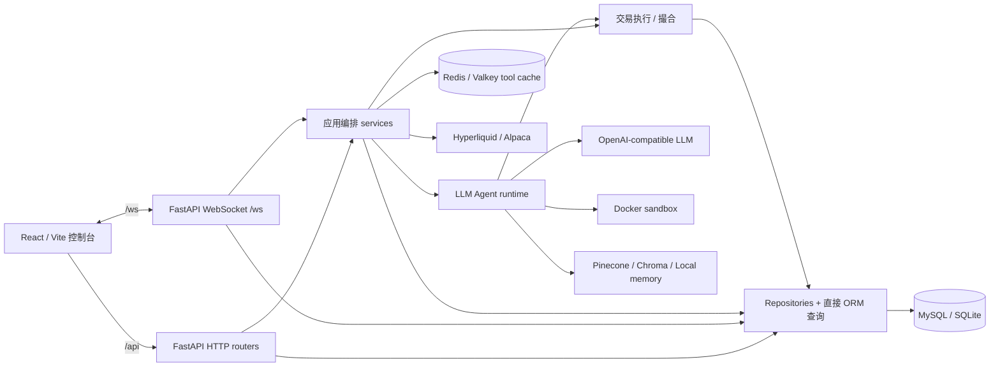
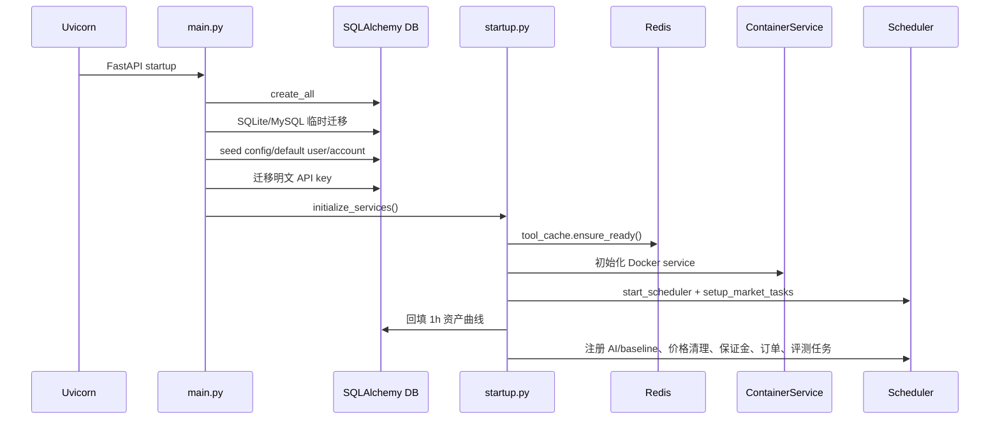
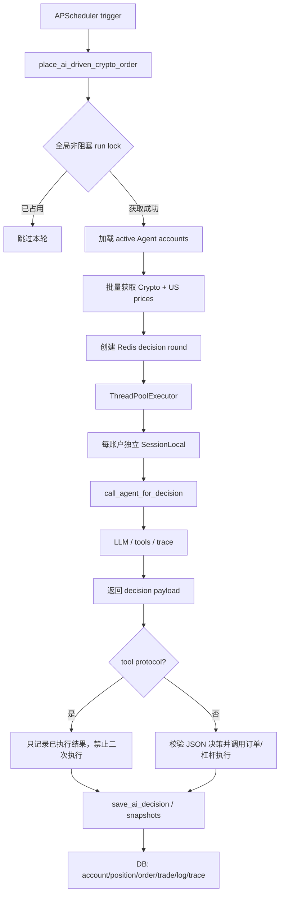

# Open Alpha Arena 当前系统架构分析

> 文档性质：基于当前源码的现状分析（as-is），用于指导后续代码结构整理。  
> 核验基线：Git commit `abb252d`，核验日期 2026-07-12。  
> 范围：`frontend/`、`backend/`、`docker-compose.yml` 以及直接影响运行时的配置。  
> 说明：本文描述的是代码实际行为，不把 `docs/refactor/` 中的目标设计当作已实现事实。

## 1. 结论摘要

Open Alpha Arena 是一个以 FastAPI 后端为事实源的 LLM 纸面交易系统。其运行时主链可以概括为：

```text
React 控制台
  -> HTTP / WebSocket
  -> FastAPI 路由与 WS 会话
  -> 定时任务 / 业务编排服务
  -> Agent 决策或 baseline 策略
  -> 交易执行与撮合
  -> SQLAlchemy 数据库

横向依赖：Redis tool cache、行情提供方、LLM Provider、Docker Agent 沙箱、向量记忆服务
```

代码已经有前端、API、Service、Agent、Repository、Database 等物理目录，但尚不是严格分层架构。当前最核心的架构特征是：

1. **后端是交易事实源。** 账户、资金、持仓、订单、成交、AI 决策、Agent trace、评测检查点与曲线快照均由后端和数据库维护；前端只展示、发命令和订阅快照。
2. **存在两条 AI 决策协议。** Legacy 路径返回 JSON 后由 `trading_commands` 执行；Agent/tool 路径可在 `execute_trade` 工具中立即执行。后者返回后必须阻止二次执行。
3. **调度器是主要业务入口。** 自动交易、行情刷新、资产曲线、保证金监控、限价单处理和评测检查点均在启动阶段注册为后台任务。
4. **Service 层过宽。** `trading_commands.py` 同时负责账户选择、行情聚合、并发决策、协议分流、执行与日志；API/WS 也有不少直接 ORM 查询和事务操作。
5. **Repository 层覆盖不完整。** 只有 user/account/order/position/kline 的部分访问被封装，大量查询仍散落在路由和服务中。
6. **启动过程包含大量副作用。** `main.py` 在 FastAPI startup 中建表、执行临时迁移、种子初始化、密钥迁移并启动基础设施和后台任务。
7. **接口存在漂移风险。** 前端类型为手写；同时存在未注册路由模块和前端仍保留的旧接口封装，缺少单一契约源。

## 2. 分析方法与可验证性

本文通过以下事实交叉核验架构：

- 应用装配与生命周期：`backend/main.py`、`backend/services/startup.py`；
- HTTP/WS 边界：`backend/api/*.py`、`frontend/app/lib/*.ts`、`frontend/app/main.tsx`；
- 自动交易链：`scheduler.py`、`trading_commands.py`、`ai_decision_service.py`；
- Agent 链：`agent/factory.py`、`react.py`、`multi_agent*.py`、`env_wrapper.py`、`tools.py`；
- 交易落地：`trade_execution_tool.py`、`order_matching.py`、`order_executor_leverage.py`；
- 持久化：`database/connection.py`、`database/models.py`、`repositories/*.py`；
- 基础设施：`tool_cache.py`、行情 provider、`container_service.py`、Docker Compose 与代理配置。

后续代码变化后，可按第 12 节的核验清单重新验证本文。文中路径均相对仓库根目录。

## 3. 运行时全景与部署边界



### 3.1 本地开发

- 根 `package.json` 用 `pnpm run dev` 同时启动后端与前端。
- 后端在 `5611`，入口为 `backend/main.py:app`。
- 前端在 `5621`；`frontend/vite.config.ts` 将 `/api` 和 `/ws` 代理到后端。
- 前端 API 使用相对路径 `/api`，WebSocket 根据当前页面 host 生成 `/ws` 地址。

### 3.2 Docker 部署

`docker-compose.yml` 定义四个进程边界：

| 容器 | 职责 | 关键依赖 |
| --- | --- | --- |
| `frontend` | Nginx 托管 Vite 静态文件并反向代理 | `backend` |
| `backend` | FastAPI、scheduler、Agent 与交易服务 | MySQL、Redis、Docker socket |
| `mysql` | 生产/并发场景持久化事实源 | volume `mysql-data` |
| `redis` | Agent 工具调用的轮次缓存和锁 | 后端启动时强制健康检查 |

`frontend/nginx.conf` 将 `/api/` 转发到后端 `/api/`，并为 `/ws` 设置 Upgrade 头。后端挂载宿主机 Docker socket，以便 `ContainerService` 管理 Agent 沙箱容器。

## 4. 当前实际分层

### 4.1 前端展示与控制层

**位置：** `frontend/app/`

**职责：**

- `main.tsx` 持有顶层用户、账户、overview、持仓、订单、成交、AI 决策和全账户资产曲线状态；
- `components/portfolio`、`trading`、`agent`、`memory`、`compliance` 分域展示和发起操作；
- `lib/api.ts` 封装主要 HTTP 调用并手写 DTO；
- `lib/compliance-api.ts` 单独封装规则与合规接口；
- WebSocket 用于 bootstrap、账户切换、下单、快照与曲线更新。

**关键接口：**

| 接口 | 消费方 | 作用 |
| --- | --- | --- |
| `apiRequest(endpoint, options)` | 各前端 API 函数 | 统一 `/api` 请求、JSON 与错误处理 |
| `getAccounts()` | 顶层 App / 设置 UI | 获取 `/api/account/list` |
| `getDecisionSchedule()` | 账户/状态 UI | 获取下一次 AI 决策时间 |
| `getLatestTraceId()` / `getAgentTrace()` | Agent 状态页 | 展示 trace |
| memory / compliance API | 对应 dashboard | 展示记忆与规则评测 |
| `resolveWsUrl()` | `main.tsx` | 同源构造 `/ws` |

**边界现状：** 前端没有交易计算权，但 DTO 在 `main.tsx`、`api.ts` 和组件内重复声明，且多处组件直接 `fetch()`。这使接口调整难以集中验证。

### 4.2 接入层：FastAPI HTTP 与 WebSocket

**位置：** `backend/main.py`、`backend/api/`

`main.py` 实际注册的 HTTP router 为：

| Router | 前缀 | 主要能力 |
| --- | --- | --- |
| `market_data_routes` | `/api/market` | 价格、Kline、市场状态 |
| `order_routes` | `/api/orders` | 创建、执行、取消和批量处理订单 |
| `account_routes` | `/api/account` | 当前账户管理、overview、曲线、LLM 测试 |
| `config_routes` | `/api/config` | 必需配置检查 |
| `ranking_routes` | `/api/ranking` | 因子排名与标的列表 |
| `crypto_routes` | `/api/crypto` | Crypto 标的、价格、状态 |
| `agent_routes` | `/api/agent` | trace 查询 |
| `memory_routes` | `/api/memory` | 记忆查询、指标与清理 |
| `rule_routes` | `/api/rules` | 规则摘要与列表 |
| `compliance_routes` | `/api/compliance` | 合规历史、趋势、统计 |
| `evaluation_routes` | `/api/evaluation` | 周期检查点、leaderboard、对比 |

另外 `main.py` 直接提供 `/api/health`、`/ws`、根静态页面和 SPA catch-all。

**重要偏差：** `backend/api/user_routes.py`（`/api/users`）和 `backend/api/account_management_routes.py`（`/api/accounts`）存在，但未被 `main.py` import/include。因此 `frontend/app/lib/api.ts` 中 `loginUser()`、`listTradingAccounts()` 等封装按当前应用装配不可达。整理结构前应决定是正式注册并维护，还是删除这组遗留契约。

API 层并非严格薄层：

- `order_routes.py` 直接调用撮合服务并负责 commit/rollback；
- `account_routes.py` 直接查询和修改 `Account`、`Position`；
- `evaluation_routes.py`、`compliance_routes.py` 和 `agent_routes.py` 直接查询 ORM；
- `ws.py` 同时承担连接管理、身份/账户切换、订单创建和快照组装。

### 4.3 应用编排与调度层

**位置：** `backend/services/startup.py`、`scheduler.py`、`trading_commands.py`

这是当前系统的实际应用层：它把账户、行情、Agent、交易执行、快照和评测串起来。

关键入口：

| 接口 | 调用方 | 责任 |
| --- | --- | --- |
| `initialize_services()` | FastAPI startup | 校验 Redis、初始化 Docker、注册全部后台任务 |
| `TaskScheduler.add_interval_task()` | startup / scheduler | 封装 APScheduler interval job |
| `reset_auto_trading_job()` | startup / 配置变更 | 安排 AI 与 baseline 交易周期 |
| `place_ai_driven_crypto_order()` | scheduler | 一轮所有 Agent 账户的 AI 决策与执行 |
| `place_baseline_driven_order()` | scheduler | buy-hold/grid baseline 账户执行 |
| `run_checkpoint_jobs()` | scheduler | 写入周期评测检查点 |

`trading_commands.py` 是当前最重的编排模块。它负责：

- 加载活动账户与 baseline 账户；
- 聚合 Crypto/US 最新价格；
- 创建 Redis decision round；
- 使用 `ThreadPoolExecutor` 并发收集账户决策；
- 每个 worker 独占 `SessionLocal()`；
- 区分 Agent/tool 与 legacy JSON 决策；
- 调用撮合或杠杆执行器；
- 保存 `AIDecisionLog`。

它既是用例编排器又包含交易分发细节，是后续结构整理的首要拆分对象，但必须先冻结交易语义测试。

### 4.4 Agent 运行时层

**位置：** `backend/services/agent/`，外部编排入口在 `ai_decision_service.py`

Agent 层主要组件：

| 组件 | 关键接口 | 职责 |
| --- | --- | --- |
| Agent factory | `create_agent()` | 按 `agent_type` 创建 ReAct、多 Agent、rule-aware 或 advanced multi-agent |
| LLM adapter | `LLMClient` | OpenAI-compatible 调用及 provider 工具调用格式归一化 |
| Tool abstraction | `Tool`, `ToolRegistry` | 工具 schema、注册、查询和执行契约 |
| Tool binding | `register_default_tools()` | 将 DB session、account、trace 和 sandbox 绑定到工具 |
| ReAct loop | `ReActAgent.run()` | 多步 LLM/tool 循环、guardrail、终止控制 |
| Dynamic routing | `select_tools_for_task()` | 从完整工具集中选择当轮工具 |
| Trade tool | `execute_trade_tool()` | Agent 模式的唯一模型侧交易入口 |
| Memory | `MemoryInterface`, `get_memory_service()` | Local/Chroma/Pinecone 记忆抽象与实现 |
| Sandbox | `ContainerService` | 为账户租用 Docker 容器，执行文件/shell/Python 工具 |

`call_agent_for_decision()` 的实际职责超过一个普通 service adapter：它解析账户级能力开关、租用容器、建立 trace、注册工具、构造 Agent、执行并释放资源。`on_step` 回调逐步写入 `AgentTrace`。

默认工具经 `env_wrapper.register_default_tools()` 注入，包括行情、Kline、账户/持仓、历史、搜索子 Agent、沙箱文件与命令、记忆和 `execute_trade`。Public API 工具仅在 tool routing 开启且非 rule-aware 时注册。

### 4.5 交易执行与订单层

**位置：**

- `backend/services/agent/trade_execution_tool.py`
- `backend/services/order_matching.py`
- `backend/services/order_executor_leverage.py`
- `backend/services/order_scheduler.py`
- `backend/services/order_monitor.py`

这里维护系统最重要的金融状态不变量。

| 接口 | 语义 |
| --- | --- |
| `execute_trade_tool()` | 校验 Agent 参数、市场状态、方向/杠杆/规模，立即执行并记录结果 |
| `create_order()` | 创建普通订单并冻结所需资金/数量 |
| `check_and_execute_order()` | 检查订单成交条件并落地成交 |
| `place_and_execute_crypto()` | Crypto 杠杆开平仓的直接执行路径 |
| `cancel_order()` | 取消订单并释放冻结资产 |
| `process_all_pending_orders()` | 扫描待处理订单 |
| `OrderScheduler` | 后台周期处理 pending LIMIT 订单 |

当前存在两种执行入口，但最终都会修改 `Account`、`Position`、`Order`、`Trade` 等事实数据：普通/US 路径偏向 `order_matching`，杠杆 Crypto 路径偏向 `order_executor_leverage`。

必须维持的核心不变量包括：

- tool 模式已有 `protocol == "tool"` 或 `executed_trades` 时，编排层不得再次下单；
- Crypto short 需要杠杆大于 1；US 杠杆固定为 1；
- US 休市时拒绝交易；
- 同一 Crypto symbol 不悄然合并相反方向或不同杠杆仓位；
- 无有效价格（`None`/`0`）时不得成交；
- 失败事务 rollback 后才能继续写日志或处理下一账户；
- 金额、数量、成本和保证金按周边代码的 `Decimal` 纪律处理。

### 4.6 行情与缓存层

**位置：** `market_data.py`、`market_kline_service.py`、provider modules、`tool_cache.py`、`price_cache.py`

`services.market_data` 是业务代码读取行情的统一门面：

| 接口 | 数据流 |
| --- | --- |
| `get_last_price(symbol, market)` | 规范化市场/标的 -> Redis tool cache -> DB Kline cache/provider |
| `get_kline_data(...)` | 参数规范化 -> tool cache/DB -> Hyperliquid 或 Alpaca -> 回写 DB |
| `get_market_status(...)` | Crypto 常开或 Alpaca 市场状态 |
| `get_all_symbols_by_market()` | provider 支持列表 |

Provider 边界为：

- `hyperliquid_market_data.py`：Crypto price/Kline/status；
- `alpaca_market_data.py`：US stock price/Kline/market clock；
- `KlineRepository`：`market_klines` 的批量 upsert 与查询；
- `market_kline_service.py`：定时刷新和交易前 freshness 保证。

缓存实际上有三类：

1. Redis `RedisToolCache`：按 decision round 缓存 Agent 工具结果，是启动必需依赖；
2. SQL `market_klines`：持久化行情缓存；
3. 进程内 `PriceCache`：短期价格缓存，并由 scheduler 定期清理。

后续整理时应避免把三者模糊为同一 cache abstraction；它们的生命周期、失败语义和一致性要求不同。

### 4.7 数据访问与持久化层

**位置：** `backend/database/`、`backend/repositories/`、`backend/schemas/`

`database.connection` 在 import 时根据 `DATABASE_URL` 构造 engine 和 `SessionLocal`：SQLite 使用 `NullPool`，其他数据库使用可配置连接池；MySQL 路径会尝试先创建目标 database。

核心数据域：

| 数据域 | ORM 模型 |
| --- | --- |
| 用户与账户 | `User`, `Account`, `UserAuthSession` |
| 交易账本 | `Position`, `Order`, `Trade`, `TradingConfig` |
| 行情 | `CryptoPrice`, `MarketKline` |
| Agent 可观测性 | `AIDecisionLog`, `AgentTrace`, `AgentMemory` |
| 资产与评测 | `AccountSnapshot`, `AssetCurveSnapshot`, `AgentPeriodCheckpoint` |
| 合规 | `AssetMetadata`, `RuleEvaluationResult` |
| 系统配置 | `SystemConfig` |

Repository 当前只覆盖：

- `account_repo`：账户创建、查询、现金更新、启停；
- `user_repo`：用户、密码和 session token；
- `position_repo`：持仓读取与 upsert；
- `order_repo`：基础订单创建与读取；
- `kline_repo.KlineRepository`：Kline 查询/upsert。

它不是完整数据访问边界：trade、decision、trace、evaluation、snapshot、compliance 等仍由 service/API 直接使用 SQLAlchemy。`backend/schemas/` 也仅覆盖部分 HTTP DTO，很多 route 返回临时 dict。这正是“目录存在但分层未闭合”的主要证据。

### 4.8 评测、合规与观测层

**位置：** `backend/services/evaluation/`、`backend/api/evaluation_routes.py`、`compliance_routes.py`、`agent_routes.py`

该层包含两种不同工作负载：

- **在线周期评测：** `checkpoint_service.run_checkpoint_jobs()` 由 scheduler 轮询，按 `(account, interval, period_end)` 幂等写入资产、PnL、收益率和波动率；
- **离线/批量 Agent 评测：** data loader、tool-use evaluator、LLM judge、risk/memory/rule evaluator 从 trace 和业务数据计算指标。

观测数据主要落在 `AIDecisionLog` 与 `AgentTrace`；HTTP API 提供 trace、评测榜单和合规统计。当前没有独立 observability adapter，业务模块直接写日志、ORM trace 和 decision log。

## 5. 关键调用链

### 5.1 应用启动链



启动的硬失败边界是 Redis；Docker 初始化、order scheduler、evaluation job 等部分子系统记录错误后可能继续运行。该不一致应在未来显式定义为 readiness policy。

### 5.2 自动 AI 交易主链



并发边界值得保留：worker 中不能复用主线程 SQLAlchemy session；主线程拿到结果后再处理 payload。`_ai_trade_run_lock` 防止 scheduler 重叠触发。

### 5.3 Agent/tool 决策链

```text
trading_commands._collect_account_decision()
  -> ai_decision_service.call_agent_for_decision()
     -> ContainerService.lease_container(account_id)
     -> LLMClient(account model/key/base_url)
     -> ToolRegistry()
     -> register_default_tools(...)
     -> [optional] register_public_api_tools(...)
     -> create_agent(account.agent_type, ...)
     -> agent.run(...)
        -> LLMClient.chat/tool calls
        -> ToolRegistry.execute(...)
        -> execute_trade_tool(...)        # 可在循环内立即交易
        -> on_step(...) -> AgentTrace
     -> decision(protocol="tool", executed_trades=[...])
  -> trading_commands._process_account_decision_payload()
     -> 检测 protocol/executed_trades，不再下单
```

这是当前最高风险调用链。重构时不能为了“统一决策接口”而抹掉“返回决策”与“已经执行”的语义差异。

### 5.4 Legacy JSON 决策链

```text
trading_commands
  -> ai_decision_service.call_ai_for_decision(account, portfolio, prices)
  -> OpenAI-compatible chat completion
  -> 解析单个 JSON decision
  -> trading_commands._process_account_decision_payload()
  -> create_order/check_and_execute_order 或 place_and_execute_crypto
  -> save_ai_decision()
```

该路径的执行所有权在 `trading_commands`，与 tool 路径的执行所有权不同。建议未来在类型层明确区分 `ProposedDecision` 与 `ExecutedDecisionResult`，而非继续依赖 dict 字段判断。

### 5.5 手工订单链

HTTP 路径：

```text
frontend -> POST /api/orders/create
  -> order_routes.create_new_order()
  -> order_matching.create_order()
  -> [MARKET 或手动触发] check_and_execute_order()
  -> DB commit
```

WebSocket 路径：

```text
frontend main.tsx -> {type: "place_order"}
  -> api.ws.websocket_endpoint()
  -> order_matching.create_order()
  -> DB commit
  -> order_pending + updated snapshot
  -> OrderScheduler 后台检查 LIMIT 成交
```

HTTP 与 WS 各自包含参数解析、事务与响应逻辑，存在语义漂移可能。未来应共享一个 application use case。

### 5.6 WebSocket 快照链

```text
App mount -> bootstrap(default user)
  -> get_or_create_user()
  -> get_or_create_default_account()
  -> manager.register(account_id, websocket)
  -> bootstrap_ok
  -> _send_snapshot()

后续 get_snapshot / switch_account
  -> _send_snapshot_optimized()
  -> repositories + ORM + market_data + asset_curve_cache
  -> snapshot_fast（高频）或 snapshot_full（周期包含曲线）
  -> React 顶层 state
```

WS manager 按 `account_id` 保存连接。代码中 `subscribe` / `switch_user` 分支仍使用 `user_id` 注册并将其传给账户快照函数，体现了历史上 user/account 订阅语义混杂；整理时应统一 subscription key。

### 5.7 行情读取链

```text
API / trading / agent tool
  -> services.market_data
  -> symbol + market normalize/validate
  -> Redis decision-round tool cache
  -> SQL market_klines cache
  -> Hyperliquid(CRYPTO) / Alpaca(US)
  -> 必要时 upsert MarketKline
  -> 返回业务调用方
```

## 6. 层间关键接口清单

下面的接口应优先被测试锁定；它们是未来移动代码时比文件位置更稳定的“架构接缝”。

| 边界 | 当前接口 | 输入/输出要点 | 建议稳定性 |
| --- | --- | --- | --- |
| UI -> HTTP | `/api/account/*`, `/orders/*`, `/market/*` 等 | JSON，类型目前手写 | 高，应生成/校验契约 |
| UI -> WS | `bootstrap`, `switch_account`, `get_snapshot`, `place_order` | message `type` 分派 | 高，应定义 discriminated union |
| Scheduler -> Trading | `place_ai_driven_crypto_order()` | 无请求上下文，自建 session | 极高 |
| Orchestrator -> Agent | `call_agent_for_decision()` | Account + portfolio + prices + session | 极高 |
| Agent -> Tools | `ToolRegistry` | JSON schema + kwargs -> serializable result | 极高 |
| Agent -> Execution | `execute_trade_tool()` | operation/market/symbol/sizing/leverage | 极高 |
| Legacy -> Execution | `_process_account_decision_payload()` | 未类型化 dict | 极高，建议先类型化 |
| Business -> Market | `get_last_price/get_kline_data/get_market_status` | market/symbol 规范化 | 高 |
| Execution -> Ledger | `create_order/check_and_execute_order/place_and_execute_crypto` | 事务内 ORM 实体 | 极高 |
| Service -> DB | repository functions / direct Session query | 当前混合 | 中，重构目标边界 |
| Runtime -> Cache | `RedisToolCache` round API | round-scoped key/cache | 高 |
| Scheduler -> Evaluation | `run_checkpoint_jobs()` | interval list -> inserted count | 中高 |

## 7. 状态所有权与事务边界

| 状态 | 当前 owner | 写入入口 | 备注 |
| --- | --- | --- | --- |
| 账户现金/冻结现金 | 交易执行服务 + 部分账户 API | order matching、leverage executor、account routes | 金融事实状态 |
| 持仓 | 交易执行服务 | order matching、leverage executor | 方向/杠杆不变量关键 |
| 订单/成交 | order services | HTTP、WS、Agent tool、scheduler | 多入口共享同一账本 |
| AI 决策 | ai decision service / trade tool | `save_ai_decision`、tool log helper | 与订单和 trace 关联 |
| Agent trace | `call_agent_for_decision.on_step` | 每一步 commit | 可观测性写入与 Agent 执行耦合 |
| 行情 Kline | market services | scheduler、按需查询回填 | SQL cache，不是交易账本 |
| 资产曲线/检查点 | snapshot/evaluation services | scheduler + startup backfill | 展示/评测衍生状态 |
| WS 页面状态 | frontend App | 后端 snapshot message | 非事实源，可重建 |

当前没有统一 Unit of Work。事务通常由 route 或 service 持有 `Session` 并手动 commit/rollback；后台线程自建 session。后续引入 application service 时，应先明确“一个命令一个事务”还是保留当前阶段性 commit（例如 Agent trace 每步 commit），否则容易改变故障恢复语义。

## 8. 主要架构债务与风险排序

### P0：交易执行所有权未类型化

Agent tool 已执行与 legacy 待执行都以 dict 返回，只靠 `protocol`/`executed_trades` 分流。字段遗漏或中间层重写可能造成重复交易。应先增加 characterization tests，再用不同结果类型表达执行所有权。

### P0：多入口交易语义可能漂移

HTTP、WS、Legacy AI 和 Agent tool 均能发起交易，校验和事务逻辑分散。目标应是共享交易 command/use case，但保留普通订单与杠杆即时执行的领域差异。

### P1：应用装配和启动副作用过重

`main.py` 同时承担 ASGI 装配、schema 管理、数据 seed、密钥迁移和 runtime bootstrap。导入应用会触发大量外部依赖，测试隔离困难。建议拆成 app factory、migration/bootstrap、service lifecycle 三部分。

### P1：路由层与 ORM 强耦合

多数 route 自行查询 ORM、拼 dict 并管理事务。Repository 不是稳定边界，导致业务逻辑难以独立测试，也难以统一鉴权、错误和事务策略。

### P1：前后端契约与实际注册漂移

前端手写类型，且调用未注册的 `/api/users` 和 `/api/accounts` API 封装仍存在。应以 FastAPI schema/OpenAPI 为契约源，并加入“前端使用端点必须存在”的检查。

### P1：WebSocket 身份模型混杂

连接管理以 account 为主，但遗留分支以 user id 注册并调用 account snapshot。应将消息 schema、订阅 key 和授权边界显式化。

### P2：Service 目录按技术和业务混排

`services/` 同时容纳应用编排、领域计算、provider adapter、缓存、scheduler 和基础设施。只移动文件不能解决依赖方向；需要先抽接口和用例边界。

### P2：迁移机制不可追踪

`create_all()` 加 `main.py` 中临时 ALTER 不能可靠表达版本顺序、回滚与多实例并发。应引入正式 migration 机制，并把启动时迁移从 Web 进程生命周期移出。

### P2：循环依赖信号

例如 `market_kline_service.py` 从 `trading_commands.py` 导入交易标的常量，行情基础服务反向依赖交易编排层。标的定义应迁到独立 config/domain 模块（已有 `trading_symbols.py` 可作为统一入口）。

## 9. 建议的目标边界（非当前实现）

以下不是对现状的误写，而是基于上述证据给出的整理方向：

```text
backend/
  bootstrap/                # app factory、生命周期、migration/seed 调用
  api/                      # HTTP/WS adapter，仅 DTO/鉴权/调用 use case
  application/
    trading/                # run decision round、place/cancel/process order
    accounts/               # account commands/queries
    evaluation/             # checkpoint use cases
  domain/
    trading/                # order/position/margin policy 与结果类型
    agents/                 # ProposedDecision / ExecutedDecisionResult
    market/                 # Symbol/Market/Price value objects
  agents/                   # LLM orchestration 与工具 adapter
  infrastructure/
    persistence/            # SQLAlchemy repositories + unit of work
    market_data/            # Hyperliquid/Alpaca adapters
    cache/                  # Redis tool cache
    sandbox/                # Docker adapter
    memory/                 # Pinecone/Chroma adapters
```

推荐依赖方向：`api/scheduler -> application -> domain ports <- infrastructure adapters`。Agent 的 `execute_trade` 只调用 application trading port，不直接拥有另一套账本更新逻辑。

## 10. 建议整理顺序

1. **冻结行为。** 为 tool 模式不重复执行、HTTP/WS 下单一致性、并发 session 隔离、价格无效拒绝、持仓方向/杠杆规则补齐测试。
2. **冻结契约。** 盘点实际注册的 OpenAPI 与 WS message，删除或恢复未注册接口；前端 DTO 改由 schema 生成或契约测试校验。
3. **抽取 bootstrap。** 建立 app factory，把迁移、seed、密钥迁移、scheduler 生命周期拆开，允许测试创建无后台任务 app。
4. **建立 application commands。** 先统一手工下单 HTTP/WS 入口，再拆 AI decision round orchestrator。
5. **类型化决策结果。** 用明确类型区分 proposed 与 already-executed，移除脆弱的 dict 字段约定。
6. **补齐 repository/UoW。** 优先覆盖交易账本，然后覆盖 trace、decision、snapshot、evaluation；避免一次性机械包装所有查询。
7. **隔离 provider。** 让 market/cache/LLM/sandbox/memory 通过 ports 接入，并定义 timeout、重试、fallback 和 readiness。
8. **迁移数据库。** 引入版本化 migration，移除 `main.py` 中 ad-hoc ALTER。
9. **最后移动目录。** 在接口和测试稳定后再按目标边界搬文件，避免仅改变路径却保留循环依赖。

## 11. 重构期间必须保持的护栏

- 后端继续是账户和交易事实源；WS 快照只读展示。
- `protocol == "tool"` 或带 `executed_trades` 的结果不得二次执行。
- scheduler 并发决策的每个 worker 使用独立 DB session，并确保关闭。
- 自动交易循环保持非重叠执行。
- Redis tool cache 的 mandatory/fail-fast 语义若要改变，必须作为显式产品决策。
- 行情 `None`/`0` 不得视为有效成交价。
- 保持 account 级 `agent_type`、`memory_enabled`、`tool_routing_enabled`、`enable_rule_aware`、`is_active` 兼容。
- 保持 SQLite 本地 fallback 与 MySQL 并发路径的差异测试。
- 任何金融状态重构必须覆盖 cash、frozen cash、position、order、trade、commission、interest 与 margin 的一致性。

## 12. 文档复核清单

代码变更后，使用以下检查判断本文是否失效：

```bash
# 应用实际装配
rg -n 'include_router|app.websocket|on_event' backend/main.py

# HTTP 与 WS 公开接口
rg -n '@router\.|elif kind ==' backend/api

# 自动交易和执行入口
rg -n '^def (place_ai_driven_crypto_order|_process_account_decision_payload|execute_trade_tool|create_order|check_and_execute_order|place_and_execute_crypto)' backend/services

# 后台任务注册
rg -n 'add_interval_task|reset_auto_trading_job|start_.*scheduler' backend/services

# 跨层直接 ORM 使用
rg -n 'db\.query|SessionLocal' backend/api backend/services

# 前端调用的端点与 WS 消息
rg -n 'apiRequest\(|fetch\(|new WebSocket|type: .(bootstrap|switch_account|get_snapshot|place_order)' frontend/app
```

建议至少运行以下高风险路径测试作为结构整理的回归门槛：

```bash
cd backend
uv run pytest test/trade_execution_semantics_test.py
uv run pytest test/test_tool_selector_execute_trade.py
uv run pytest test/test_trading_loop_lock_isolation.py
uv run pytest tests/trading_commands_immediate_execution_test.py
uv run pytest test/test_scheduler_first_decision_timing.py
uv run pytest test/test_tool_call_guardrails.py
uv run pytest test/test_llm_tool_signature_roundtrip.py
```

## 13. 直接证据索引

| 结论 | 源码位置 |
| --- | --- |
| FastAPI 装配、路由、启动迁移 | `backend/main.py` |
| Redis mandatory 与后台任务启动 | `backend/services/startup.py` |
| APScheduler 与任务注册 | `backend/services/scheduler.py` |
| AI round、并发和协议分流 | `backend/services/trading_commands.py` |
| Legacy/Agent 决策入口与 trace 写入 | `backend/services/ai_decision_service.py` |
| Agent 类型构造 | `backend/services/agent/factory.py` |
| ReAct 工具循环与重复执行防线 | `backend/services/agent/react.py` |
| 默认工具绑定 | `backend/services/agent/env_wrapper.py` |
| Agent 即时交易语义 | `backend/services/agent/trade_execution_tool.py` |
| 普通订单创建/撮合/取消 | `backend/services/order_matching.py` |
| Crypto 杠杆执行 | `backend/services/order_executor_leverage.py` |
| 行情统一门面 | `backend/services/market_data.py` |
| Redis tool cache | `backend/services/tool_cache.py` |
| ORM 与关系 | `backend/database/models.py` |
| engine/session | `backend/database/connection.py` |
| 前端 HTTP 契约 | `frontend/app/lib/api.ts` |
| 前端 WS 状态机 | `frontend/app/main.tsx` |
| 后端 WS 消息分派与快照 | `backend/api/ws.py` |
| 开发代理 | `frontend/vite.config.ts` |
| 部署代理 | `frontend/nginx.conf` |
| 容器拓扑 | `docker-compose.yml` |

---

本文应与 `docs/refactor/` 的 RFC 配合使用：本文回答“系统现在如何运行、边界实际在哪里”，RFC 回答“希望演进到哪里”。在实施任何结构调整时，应以本文列出的调用链、状态所有权和护栏作为行为基线。
