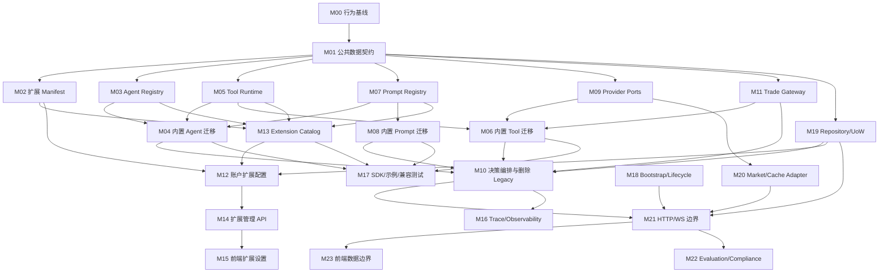

# 模块级重构任务索引

本目录是 Open Alpha Arena 结构重构的实施任务清单。它不修改或替代 `docs/refactor/0000-0010`，而是把现有 RFC 和 `docs/current_system_architecture_analysis.md` 落成可以由不同开发者独立认领的代码任务。

团队评审时可先阅读 [重构方案说明](refactor-explanation-for-team.md)，开发排期和任务认领参考 [模块分组与并行开发计划](module-groups.md)，再按需查看公共接口规范和各模块任务。

## 固定约束

- 只调整代码结构、接口、配置入口和依赖方向，不改变交易、行情、评测、前端展示等现有功能。
- 删除 Legacy JSON 决策路径：删除 `call_ai_for_decision()`、`AgentConfig.USE_AGENT` 分支及对应 legacy dispatcher；不提供兼容层。
- 现有 ReAct、MultiAgent、AdvancedMultiAgent、RuleAware、buy-hold、grid 行为必须保持。
- 保留当前系统使用 `ThreadPoolExecutor` 按账户并行运行 Agent 的逻辑；Agent、Tool、Provider 和交易接口对系统保持同步。
- 外部 Agent 如需内部异步或额外线程，必须自行封装在同步 `run()` 中；系统不提供异步 SPI 或兼容层。
- 后端继续是账户、订单、成交、持仓与资金的唯一事实源。
- 扩展不得直接获得 SQLAlchemy `Session`，不得直接修改 ORM 交易实体。
- 开源用户应能只通过 manifest、配置文件、Prompt 文件和公开 Python 接口完成 Agent、Tool、Prompt 的替换或扩展。
- 不把结构重构与算法、Prompt 文案、交易规则、UI 视觉升级放进同一任务。

## 统一交付规则

每个任务 PR 必须满足：

1. 只实现任务文档中列出的目标；新增必要文件可以，但不得顺带重写相邻模块。
2. 公共类型和接口严格遵循 [公共接口规范](000-public-interface-spec.md)。需要修改规范时必须先单独评审规范变更。
3. 迁移已有实现时先写 characterization test；迁移后同一输入得到等价输出和副作用。
4. 不保留两套生产实现。过渡 adapter 只允许在任务明确列出的阶段存在，并在指定清理任务删除。
5. 所有公开接口必须有 docstring、类型标注、错误类型和最小使用示例。
6. 必须报告运行过的测试；外部 provider 测试必须标记为 integration。

## 依赖批次与并行安排

下图表达 Module 依赖；团队实际分组、开发波次和高冲突文件 Owner 以 [模块分组与并行开发计划](module-groups.md) 为准。



同一层中无箭头相连的任务可以并行。例如 M03、M05、M07、M09、M11、M19 可在 M01 合并后由不同开发者同时实施。

## 任务清单

| ID | 交付模块 | 主要现有文件 | 前置任务 |
| --- | --- | --- | --- |
| [M00](M00-characterization-tests.md) | 结构重构行为基线测试 | `backend/test`, `backend/tests` | 无 |
| [M01](M01-core-contracts.md) | 公共上下文、结果、错误和版本类型 | 新增 `backend/alpha_arena/contracts` | M00 |
| [M02](M02-extension-manifest.md) | 扩展包 manifest 与配置校验 | 新增 `backend/alpha_arena/extensions` | M01 |
| [M03](M03-agent-registry.md) | Agent SPI、工厂与 registry | `services/agent/base.py`, `factory.py` | M01 |
| [M04](M04-builtin-agent-migration.md) | 四种内置 Agent adapter | `react.py`, `multi_agent*.py`, `rule_aware` | M03、M05、M07 |
| [M05](M05-tool-runtime.md) | Tool SPI、registry、执行器与权限 | `tools.py`, `tool_selector.py` | M01 |
| [M06](M06-builtin-tool-migration.md) | 内置工具包拆分与注册 | `env_wrapper.py`, memory/public API tools | M05、M09、M11 |
| [M07](M07-prompt-registry.md) | Prompt 模板、变量、装载与覆盖 | 新增 Prompt runtime | M01 |
| [M08](M08-builtin-prompt-migration.md) | 现有 Python Prompt 文件化 | `agent/prompts`, `rule_aware/prompts.py` | M07 |
| [M09](M09-provider-ports.md) | LLM、Memory、Market、Sandbox ports | 对应 service/provider | M01 |
| [M10](M10-decision-orchestration.md) | 单一 Agent 决策轮次与删除 Legacy | `trading_commands.py`, `ai_decision_service.py` | M04、M06、M08、M11、M19 |
| [M11](M11-trade-command-gateway.md) | Tool/HTTP/WS 共用交易命令网关 | 订单与杠杆执行模块 | M01、M00 |
| [M12](M12-account-extension-config.md) | 账户的 Agent/Tool/Prompt 配置模型 | Account model/schema/repo | M02、M13、M19 |
| [M13](M13-extension-catalog.md) | 扩展发现、装载、冲突与健康状态 | bootstrap + extension runtime | M02、M03、M05、M07 |
| [M14](M14-extension-management-api.md) | 扩展 catalog/config HTTP API | `backend/api`, schemas | M12、M13 |
| [M15](M15-frontend-extension-settings.md) | 无源码配置 Agent/Tool/Prompt 的 UI | settings、API client | M14 |
| [M16](M16-trace-observability.md) | Agent/tool/prompt 版本与 trace 关联 | trace、decision log | M10、M13 |
| [M17](M17-sdk-examples-contract-tests.md) | 开源扩展 SDK、样例与契约测试 | docs/examples/test kit | M04、M06、M08、M13 |
| [M18](M18-bootstrap-lifecycle.md) | App factory、seed、迁移和任务生命周期 | `main.py`, `startup.py`, scheduler | M00 |
| [M19](M19-repositories-unit-of-work.md) | Repository 与事务边界 | database/repositories/services | M01 |
| [M20](M20-market-cache-adapters.md) | Market facade 与三类 cache adapter | market/cache modules | M09 |
| [M21](M21-http-websocket-boundaries.md) | 薄 HTTP route 与 WS 会话边界 | `backend/api/*` | M10、M11、M18、M19、M20 |
| [M22](M22-evaluation-compliance.md) | 评测与合规模块接口整理 | evaluation/compliance | M16、M19、M21 |
| [M23](M23-frontend-data-boundaries.md) | 现有前端 API/WS/hook 分层 | `frontend/app` | M21 |

## 冲突控制

高冲突文件只允许由指定任务主改：

| 文件 | 所属任务 |
| --- | --- |
| `backend/services/trading_commands.py` | M10 |
| `backend/services/ai_decision_service.py` | M10 |
| `backend/services/agent/env_wrapper.py` | M06 |
| `backend/services/agent/tools.py` | M05 |
| `backend/services/agent/factory.py` | M03 |
| `backend/main.py`, `backend/services/startup.py` | M18 |
| `backend/database/models.py` | M12/M19，必须串行协调 |
| `frontend/app/lib/api.ts` | M23；M15 只新增 extension client，最后由 M23 汇总 |
| `frontend/app/main.tsx` | M23 |

## 完成定义

全部任务完成后，开源用户应能完成以下操作而不修改核心源码：

```text
1. 创建一个扩展目录并填写 alpha-arena-extension.yaml
2. 实现公开 Agent 或 Tool Protocol，或只提供 Prompt 文件
3. 运行扩展校验命令/契约测试
4. 启动系统，在 catalog API/UI 中看到扩展及其健康状态
5. 为账户选择 agent_id、toolset_ids、prompt_profile_id 和配置
6. 下一轮决策使用新配置；交易仍只经 TradeCommandGateway 落地
```
