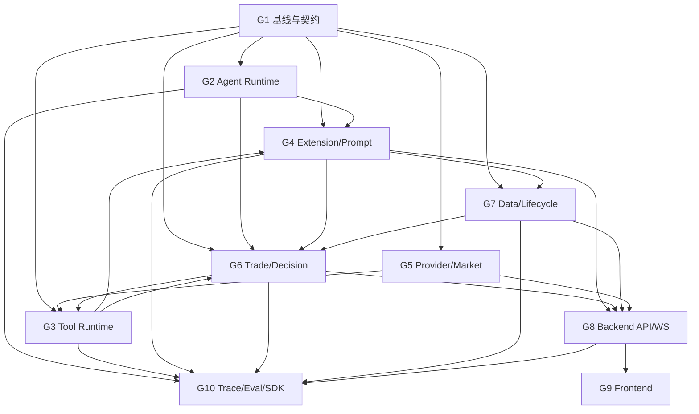

# 模块分组与并行开发计划

本文把 M00–M23 按主要修改代码、逻辑责任和合并冲突分成 10 个工作组。每个 Module 只有一个主归属组；依赖其他组时通过接口和集成节点协作，不允许两个组同时主改同一个高冲突文件。

公共接口以 [公共扩展接口规范](000-public-interface-spec.md) 为准，具体任务以各 M 文档为准。

## 1. 共同并发约束

所有涉及 Agent 的小组必须遵守同一个执行模型：

```text
系统层：ThreadPoolExecutor 按账户并行
  -> account worker 1 -> 同步 Agent.run()
  -> account worker 2 -> 同步 Agent.run()
  -> account worker 3 -> 同步 Agent.run()

单个 Agent 内：
  LLM -> Tool -> ToolResult -> 下一步 LLM
  全部对系统同步、顺序执行
```

- `AGENT_MAX_CONCURRENCY` 控制账户 worker 数。
- 每个账户 worker 使用独立 Session/UoW。
- Agent、Tool、Provider、Trade Gateway 的公共 SPI 都是同步接口。
- 外部 Agent 可以自行在同步 `run()` 内实现异步或线程池，但系统不适配、不管理、不承诺兼容。

## 2. 分组总览

| 组 | 名称 | Modules | 主要代码范围 | 组内主线 |
| --- | --- | --- | --- | --- |
| G1 | 行为基线与公共契约 | M00、M01 | tests、`alpha_arena/contracts` | M00 -> M01 |
| G2 | Agent Runtime 与内置 Agent | M03、M04 | `agents`、`services/agent/{base,factory,react,multi_agent*}` | M03 -> M04 |
| G3 | Tool Runtime 与内置工具 | M05、M06 | `tools`、`env_wrapper`、memory/search/public API tools | M05 -> M06 |
| G4 | 扩展声明、Prompt 与 Catalog | M02、M07、M08、M13 | `extensions`、`prompts`、内置 Prompt 资源 | M02/M07 -> M08；M13 最后 |
| G5 | Provider、行情与缓存 | M09、M20 | provider ports、market/cache modules | M09 -> M20 |
| G6 | 交易网关与决策调度 | M11、M10 | order/leverage、`trading_commands`、`ai_decision_service` | M11 -> M10 |
| G7 | 数据访问、账户配置与生命周期 | M19、M18、M12 | database/repositories、bootstrap、account runtime config | M19/M18 并行；M12 后接 |
| G8 | 后端 API 与 WebSocket | M14、M21 | `backend/api`、schemas、application adapters | M14 可先做；M21 集成 |
| G9 | 前端配置与数据边界 | M15、M23 | frontend API、WS、hooks、Settings | M15 -> M23 收口 |
| G10 | Trace、评测与开源交付 | M16、M22、M17 | trace/event、evaluation/compliance、SDK/examples | M16 -> M22；M17 最后 |

## 3. G1：行为基线与公共契约

### 包含任务

- M00：结构重构行为基线测试
- M01：公共数据契约包

### 修改范围

```text
backend/test/
backend/tests/
backend/alpha_arena/contracts/
backend/pyproject.toml
```

### 分工和顺序

M00 可拆为四个并行子任务：Agent、交易、HTTP/WS、baseline。测试 fixture owner 先冻结 fake LLM、market 和 session API。

M01 在 M00 fixture 基本稳定后实现。公共 DTO 和异常需要单一 owner，其他组不得自行复制或增加同义结果类型。

### 交付门槛

- 无外部服务可运行 characterization tests。
- 固定账户线程池并发、单 Agent 同步工具顺序和 worker session 隔离。
- `alpha_arena.contracts` 可独立 import，无启动副作用。

### 下游

M01 合并后，G2、G3、G4、G5、G6、G7 可以开始主体开发。

## 4. G2：Agent Runtime 与内置 Agent

### 包含任务

- M03：Agent SPI、Factory 与 Registry
- M04：内置 Agent 迁移

### 修改范围

```text
backend/alpha_arena/agents/
backend/alpha_arena/builtin/agents/
backend/services/agent/base.py
backend/services/agent/factory.py
backend/services/agent/core.py
backend/services/agent/react.py
backend/services/agent/multi_agent.py
backend/services/agent/multi_agent_advanced.py
backend/services/agent/rule_aware/
```

### 分工和顺序

1. M03 owner 先完成同步 Agent SPI、Registry 和 Runtime。
2. Registry 冻结后，M04 可将四种内置 Agent 分给四名开发者并行适配。
3. `factory.py` 由 M03 owner 先改 facade，再由 M04 集成人员删除硬编码分支，禁止同时修改。

### 跨组接口

- 从 G3 使用 `ToolInvoker`，不直接 import内置工具。
- 从 G4 使用 `PromptResolver`，不直接 import Prompt 常量。
- 从 G5 使用同步 Provider ports。

### 交付门槛

- 四种 Agent 都通过 `core.*` component id 构建。
- `Agent.run()` 同步返回；awaitable 结果明确拒绝。
- 内置 Agent 行为、Prompt hash、工具顺序和交易副作用与基线一致。

## 5. G3：Tool Runtime 与内置工具

### 包含任务

- M05：Tool SPI、Registry、Invoker 与权限
- M06：内置工具包拆分与迁移

### 修改范围

```text
backend/alpha_arena/tools/
backend/alpha_arena/builtin/tools/
backend/services/agent/tools.py
backend/services/agent/env_wrapper.py
backend/services/agent/memory_tools.py
backend/services/agent/history_tool.py
backend/services/agent/public_apis_registry.py
backend/services/agent/sub_agents/search_agent.py
```

### 分工和顺序

1. M05 单一 owner 冻结同步 Tool SPI、Invoker pipeline 和 capability。
2. M06 按 market/account/search/sandbox/memory/trading 六个 provider 并行迁移。
3. `env_wrapper.py` 只由 M06 集成人员最后清理，其他 provider 开发者只新增目标模块和测试。

### 跨组接口

- trading tool 只调用 G6 的 `TradeCommandGateway`。
- market/memory/sandbox/search 只调用 G5 的 Provider ports。
- tool 注册由 G4 Catalog 完成。

### 交付门槛

- 工具同步完成后 Agent 才进入下一步。
- Tool/Provider 返回 awaitable 时契约测试失败。
- 默认工具集合、参数 schema、结果和副作用与当前实现等价。

## 6. G4：扩展声明、Prompt 与 Catalog

### 包含任务

- M02：扩展 Manifest 与静态校验
- M07：Prompt Registry、模板与覆盖
- M08：内置 Prompt 文件化迁移
- M13：扩展发现、装载与 Catalog

### 修改范围

```text
backend/alpha_arena/extensions/
backend/alpha_arena/prompts/
backend/alpha_arena/builtin/prompts/
backend/alpha_arena/builtin/extension/
backend/services/agent/prompts/
backend/services/agent/rule_aware/prompts.py
```

### 分工和顺序

- M02 和 M07 可立即并行。
- M08 在 M07 renderer 稳定后，按 React/MultiAgent/Advanced/RuleAware/Search-Audit Prompt 家族并行迁移。
- M13 等待 G2 Agent Registry、G3 Tool Registry 和本组 Prompt Registry 的最小接口合并后再做最终装载集成。

### 冲突控制

- Prompt 文本迁移期间禁止顺带修改文案。
- 内置 extension manifest 由 M13 owner 汇总，不由各组件组分别修改同一文件。

### 交付门槛

- Prompt-only 扩展不需要 Python。
- 内置 Prompt 最终文本逐字一致。
- 内置和外部组件通过相同 Catalog 注册，冲突和权限失败明确可见。

## 7. G5：Provider、行情与缓存

### 包含任务

- M09：LLM、Memory、Market、Sandbox Provider Ports
- M20：Market Facade 与 Cache Adapters

### 修改范围

```text
backend/alpha_arena/providers/
backend/alpha_arena/infrastructure/adapters/
backend/alpha_arena/infrastructure/market/
backend/alpha_arena/infrastructure/cache/
backend/services/agent/llm_client.py
backend/services/agent/memory*.py
backend/services/container_service.py
backend/services/market_data.py
backend/services/market_kline_service.py
backend/services/hyperliquid_market_data.py
backend/services/alpaca_market_data.py
backend/services/tool_cache.py
backend/services/price_cache.py
backend/repositories/kline_repo.py
```

### 分工和顺序

M09 可分为 LLM、Memory、Market、Sandbox 四个 adapter 并行。公共 Provider error/health 类型由一人先冻结。

M20 在 Market port 稳定后，可将 provider adapter、Kline repository、Redis tool cache、进程 PriceCache 分为四支并行。

### 交付门槛

- Provider 对系统全部暴露同步接口。
- 行情 0/None/异常的交易拒绝行为不变。
- Redis、SQL Kline、PriceCache 三类缓存边界明确。
- 清除 `market_kline_service -> trading_commands` 反向依赖。

## 8. G6：交易网关与决策调度

### 包含任务

- M11：统一 Trade Command Gateway
- M10：单一 Agent 决策编排与删除 Legacy JSON

### 修改范围

```text
backend/alpha_arena/application/trading/
backend/alpha_arena/application/decisions/
backend/services/order_matching.py
backend/services/order_executor_leverage.py
backend/services/agent/trade_execution_tool.py
backend/services/trading_commands.py
backend/services/ai_decision_service.py
backend/services/auto_trader.py
backend/config/agent_config.py
```

### 分工和顺序

1. M11 先用 adapter 包住现有普通订单和杠杆执行，不改计算逻辑。
2. M10 等 G2/G3/G4 的内置迁移和 G7 UoW 最小接口完成后开始集成。
3. `trading_commands.py` 和 `ai_decision_service.py` 由 M10 单一 owner 修改。

### 必须保留的调度逻辑

```text
place_ai_driven_crypto_order
  -> ThreadPoolExecutor(max_workers=AGENT_MAX_CONCURRENCY)
  -> 每账户独立 worker/session
  -> worker 内同步 AgentRuntime.run()
  -> as_completed 收集结果
```

### 交付门槛

- Legacy JSON 决策代码完全删除。
- 不同账户并行，单账户 Agent/Tool/Trade 同步。
- 一次工具调用最多产生一笔交易。
- `_ai_trade_run_lock` 和 baseline 独立调度保持。

## 9. G7：数据访问、账户配置与生命周期

### 包含任务

- M19：Repository 与 Unit of Work
- M18：App Factory、Bootstrap 与后台任务生命周期
- M12：账户扩展配置模型与迁移

### 修改范围

```text
backend/alpha_arena/persistence/
backend/alpha_arena/bootstrap/
backend/database/
backend/repositories/
backend/database/models.py
backend/main.py
backend/services/startup.py
backend/services/scheduler.py
backend/schemas/account.py
```

### 分工和顺序

- M19 和 M18 可并行：M19 不修改 `main.py`，M18 不设计 repository 业务接口。
- `database/models.py` 先由 M19 owner 完成基础协调，再交给 M12 增加账户 runtime config，禁止并行改同一区域。
- M12 等 G4 Catalog validation API 可用后完成保存校验。

### 交付门槛

- 同步 UoW，不存在 async session 伪装。
- 每个账户 worker 独立 UoW/session，不跨线程复用。
- 旧账户配置幂等迁移到新的 Agent/Tool/Prompt 配置。
- app import 无后台任务和 DB 写副作用；FULL 模式行为保持。

## 10. G8：后端 API 与 WebSocket

### 包含任务

- M14：扩展 Catalog 与账户配置 API
- M21：HTTP Route 与 WebSocket 会话边界

### 修改范围

```text
backend/api/
backend/schemas/
backend/services/extension_config_service.py
backend/alpha_arena/application/* 的 API adapters
```

### 分工和顺序

- M14 可在 Catalog 和账户配置 service 稳定后独立新增 router/schema。
- M21 可按 account/order/market/agent/evaluation 等 route domain 并行迁移。
- `backend/api/ws.py` 和最终 router registration 各设单一 owner。

### 边界说明

FastAPI route 和 WebSocket handler 可以继续使用 async 框架接口，但调用 Agent 决策服务时进入同步 `DecisionRoundService`/worker 模型；HTTP/WS 不创建 Agent asyncio task。

### 交付门槛

- route 不直接 query ORM 或管理交易事务。
- HTTP 与 WS 下单都调用同步 Trade Gateway adapter。
- 前端使用的端点全部存在，不可达遗留接口明确删除。

## 11. G9：前端配置与数据边界

### 包含任务

- M15：前端 Agent/Tool/Prompt 扩展设置
- M23：前端 API、WebSocket 与 Domain Hooks 分层

### 修改范围

```text
frontend/app/lib/api/
frontend/app/lib/ws/
frontend/app/hooks/
frontend/app/components/extensions/
frontend/app/components/layout/SettingsDialog.tsx
frontend/app/main.tsx
```

### 分工和顺序

- M15 可先新增 extension API、hooks 和 UI，不主改 `main.tsx`。
- M23 可按 accounts/trading/market/agent/evaluation/compliance client 并行。
- `api.ts` 和 `main.tsx` 由 M23 owner 最后收口，避免多组同时搬迁。

### 交付门槛

- 用户可列出、验证和保存 Agent/Tool/Prompt 配置。
- 组件无直接 fetch，后端 DTO 不在多个组件重复声明。
- 页面和 WebSocket 功能不变。

## 12. G10：Trace、评测与开源交付

### 包含任务

- M16：Agent、Tool、Prompt 版本与 Trace 关联
- M22：Evaluation 与 Compliance 模块接口整理
- M17：扩展 SDK、样例与契约测试套件

### 修改范围

```text
backend/alpha_arena/application/evaluation/
backend/alpha_arena/application/compliance/
backend/alpha_arena/testing/
backend/services/evaluation/
backend/services/agent/rule_aware/*auditor*/*validator*
backend/api/agent_routes.py
backend/api/evaluation_routes.py
backend/api/compliance_routes.py
examples/extensions/
docs/extensions/
```

### 分工和顺序

- M16 在 Agent/Tool/Catalog event 字段稳定后实现。
- M22 可拆 checkpoint、tool-use judge、rule compliance 三支并行，但都依赖 M16 trace DTO。
- M17 的文档和样例可提前起草，最终契约测试要等 G2/G3/G4/G5 完成。

### 交付门槛

- Trace 可还原 Agent、Tool、Prompt 版本与交易引用。
- 评测指标和合规结果与当前 fixture 一致。
- SDK 示例全部使用同步 Agent/Tool/Provider SPI。
- 契约测试明确拒绝 awaitable 返回；外部内部并发不属于兼容范围。

## 13. 跨组依赖图



图中的 G6 -> G3 只表示 M06 的 trading tool adapter 需要 M11 Gateway；G3 -> G6 表示 M10 决策集成需要完整 Tool runtime。为避免循环阻塞，按以下接口切片：

1. G6 先交付 M11 Gateway 接口和 fake；
2. G3 使用该接口完成 `core.execute_trade`；
3. G6 再执行 M10 决策集成。

G4 -> G7 与 G7 -> G6 类似：G4 先交付 Catalog validation facade，G7 完成账户配置；完整 Catalog 启动集成随后完成。

## 14. 推荐开发波次

### Wave 0：基线

- G1 完成 M00、M01。

### Wave 1：接口骨架并行

- G2：M03
- G3：M05
- G4：M02、M07
- G5：M09
- G6：M11
- G7：M18、M19

这一波结束时举行一次接口冻结评审，不开始大规模迁移前先确认所有签名一致。

### Wave 2：现有实现迁移并行

- G2：M04
- G3：M06 非 trading 部分
- G4：M08、M13 基础装载
- G5：M20
- G7：M12 migration/schema
- G10：M17 示例骨架

### Wave 3：核心集成

- G3：接入 M11 的 trading tool
- G6：M10 删除 Legacy 并接入同步 Agent Runtime
- G7：完成账户配置/Catalog 校验和 bootstrap 集成
- G8：M14、M21
- G10：M16

### Wave 4：界面、评测与开源交付

- G9：M15、M23
- G10：M22、M17 完整契约测试
- 全组运行端到端和迁移前后对比。

## 15. 高冲突文件 Owner

| 文件 | Owner 组/任务 | 其他组协作方式 |
| --- | --- | --- |
| `services/trading_commands.py` | G6/M10 | 只提供接口需求，不直接修改 |
| `services/ai_decision_service.py` | G6/M10 | G2/G3 提供 adapter |
| `services/agent/env_wrapper.py` | G3/M06 | G2 不修改 |
| `services/agent/tools.py` | G3/M05 | G2 只依赖公开 SPI |
| `services/agent/factory.py` | G2/M03 后 M04 | 严格串行 |
| `database/models.py` | G7/M19 后 M12 | G10 通过 migration proposal 协作 |
| `main.py`, `services/startup.py` | G7/M18 | G4/G8 提供注册函数 |
| `backend/api/ws.py` | G8/M21 | G6 提供同步 command service |
| `frontend/app/lib/api.ts` | G9/M23 | M15 先新增独立文件 |
| `frontend/app/main.tsx` | G9/M23 | 其他组不修改 |

## 16. 每组提交要求

每个组的 PR 需要说明：

- 覆盖哪些 Module 和 TODO；
- 新增或修改了哪些公开接口；
- 是否遵守账户线程池并发、Agent/Tool 同步边界；
- 是否修改数据库 schema；
- 是否触及交易语义；
- 运行过哪些 characterization/contract/integration tests；
- 是否留下临时 adapter，以及由哪个 Module 删除；
- 与下一组约定的接口版本和 fixture。

